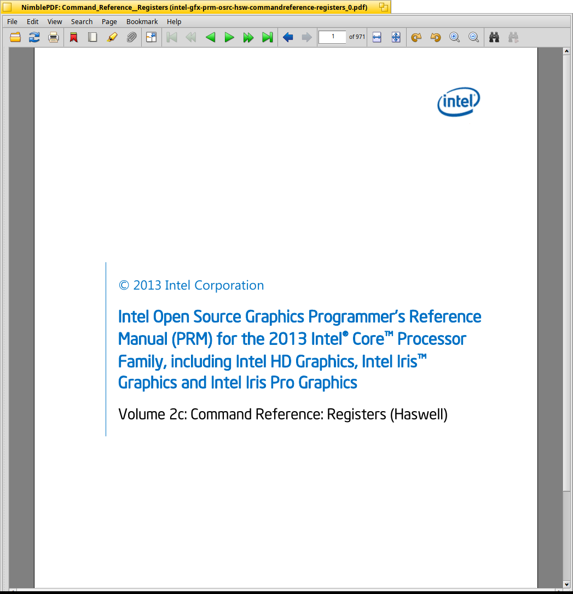
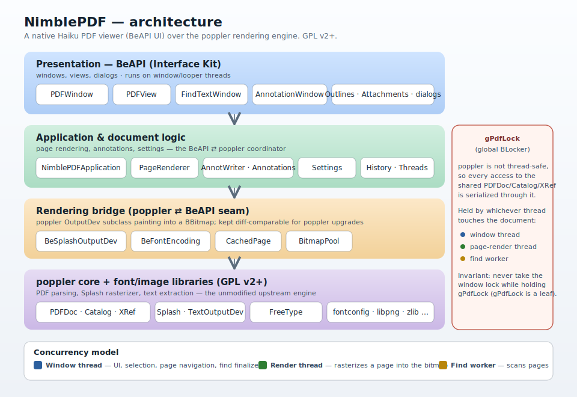

# NimblePDF

NimblePDF is a fast, lightweight, cross-platform PDF viewer, derived from
[BePDF](https://github.com/HaikuArchives/BePDF). Supported operating systems are [Haiku](https://www.haiku-os.org/), Linux, and Windows. A macOS version should not be a hard port if someone wants to take it on (I don't have a Mac to test on).

The Haiku version uses the native BeAPI and native controls. The Linux and Windows versions use Qt 6, which was chosen to make cross-platform builds easier.

PRs welcome for bug fixes, features, and ports to other operating systems.

The PDF rendering backend is [poppler](https://poppler.freedesktop.org/), which is an upgrade from [xpdf](https://www.xpdfreader.com/) which was originally used by BePDF.

See the [changelog](CHANGELOG.md) for the release history.


## Status

🚧 **Active development.** NimblePDF is under active development. 

Currently the Haiku version works (i.e. can open files, search, add annotations, etc) but there most likely will be bugs!

Linux version is in-progress, not fully ported.


## Logging Bugs / How to Help

Bugs are welcome! To log a bug, [please log it here in github as an issue](https://github.com/KevinAdams05/NimblePDF/issues), and include as much detail as possible. Please attach the PDF that is causing the error, if possible. Also attach your syslog and state which version/hrev of Haiku you are running.

PRs are welcome! See "contributing" section.

## Contributing

For Haiku changes, please test all code changes on Beta5 and the latest nightly before opening the PR! 

Any changes in the core layer should be tested on both Haiku and Linux. Please list the operating systems and versions that you tested on.

Before opening a PR, read [docs/STYLE_GUIDE.md](docs/STYLE_GUIDE.md) — it
covers the formatting and naming conventions used throughout the project
(based on Haiku's coding guidelines).

ALL operating system code should follow the same guideline, even though it is based on a Haiku style. That may seem odd for Linux developers or Windows developers, but we want consistency in the codebase.

AI/LLM changes are welcome but must still adhere to the style guide, must be **human tested**, and must have detailed notes.

Run the formatters and linter:

```sh
clang-format -i source/haiku/**/*.{cpp,h}     # uses .clang-format at repo root
python3 scripts/checkstyle-nimblepdf.py source/haiku
```

## Screenshots
**Haiku**



## Architecture
**Note:** this needs to be updated to include the Linux/Windows versions using Qt 6 



## Building

NimblePDF builds natively on Haiku using the standard
[Generic Makefile](https://www.haiku-os.org/development/learning-the-api/).
From the repository root:

```sh
./build.sh
```

Build prerequisites (Haiku), installed via `pkgman`:

- `poppler25.12_devel` and `poppler_data` (the PDF rendering engine; this
  pulls in FreeType and the other rendering libraries as dependencies)

Cross-compiling from Linux is documented in
[docs/CROSS_BUILD.md](docs/CROSS_BUILD.md) (coming soon).

## License

NimblePDF is licensed under the **GNU General Public License, version 2 or
later** (GPL v2+), as a derivative of BePDF (also GPL v2+).

- Project license: [LICENSE](LICENSE) (NimblePDF summary)
- Full GPL v2 text: [COPYING](COPYING)
- Full GPL v3 text: [COPYING3](COPYING3)

Third-party components (each retains its own license):
- **BePDF** sources — GPL v2+
- **poppler** — GPL v2 / v2+ (the rendering engine, linked as a system
  library)

See individual source-file headers for per-file copyright details.

## Credits

- **[BePDF](https://github.com/HaikuArchives/BePDF)** — the foundation NimblePDF builds on. Thanks to Benoit Triquet, Hubert Figuiere,
  Michael Pfeiffer, waddlesplash and the BePDF/HaikuArchives contributors.
- **[xpdf](https://www.xpdfreader.com/)** — the original rendering engine (Glyph & Cog), inherited via
  BePDF and since replaced by poppler.
- **[poppler](https://poppler.freedesktop.org/)** — the rendering engine NimblePDF now uses.
